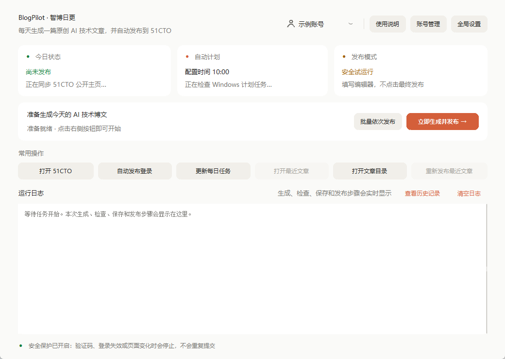
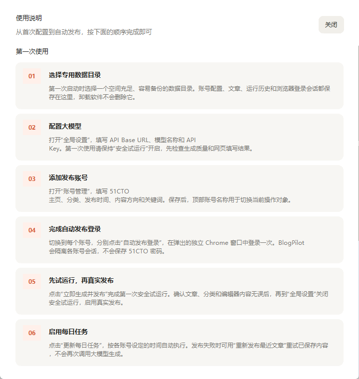

# BlogPilot（智博日更）

Windows 本地软件：为一个或多个 51CTO 账号分别生成原创 AI 技术博文，质量检查后按顺序自动发布。

在 VS Code 中调试时，可直接右键项目根目录的 `main.py`，选择“在终端中运行 Python 文件”。

## 当前能力

- 最多管理 5 个本地账号；切换账号会立即刷新该账号的今日状态、月度进度、文章与运行历史。
- 每个账号可独立设置主页、发布时间、月目标、文章分类、博文类型、内容方向和主题关键词；关键词会作为选题硬约束。
- 支持当前账号单独执行，也支持勾选多个账号后串行生成、串行发布；一个账号失败不会阻止后续账号。
- 不同账号当天的标题、主题和正文统一参与查重，避免生成相似文章。
- 发布失败后可直接重发当前账号已经保存的文章，不会再次调用大模型生成。
- 默认使用 DeepSeek OpenAI 格式接口（`https://api.deepseek.com`、`deepseek-v4-pro`），也支持其他兼容接口。
- 首次启动由用户选择专用数据目录；文章按账号保存在 `articles\generated_posts\<account_id>`，程序升级和卸载不会删除该目录。
- 检查字数、AI 主题、Markdown、密钥泄漏、标题和正文相似度。
- 使用 Windows DPAPI 加密 API Key。
- 使用电脑已有 Chrome，并为每个账号建立独立应用 Profile 和调试端口，不接触普通 Chrome Profile，也不会串用其他账号的登录窗口。
- Chrome 自动化禁用组件更新、后台同步和本地生成式 AI 功能，减少独立自动化窗口产生不必要的后台下载。
- 遇到验证码、登录失效、页面结构变化或发布结果不明确时停止。

## 运行

无需安装 Qt 或独立浏览器。开发模式：

```powershell
$env:PYTHONPATH='src'
python -m blogpost gui
```

命令行：

```powershell
python -m blogpost run-now
python -m blogpost run-now --account default --account account-xxxx
python -m blogpost run-daily
python -m blogpost login
python -m blogpost schedule install
python -m blogpost schedule status
```

## 标准安装

双击 `dist\BlogPilot-Setup-0.1.0.msi` 即可安装。程序安装在当前 Windows 用户的本地程序目录，并创建开始菜单和桌面快捷方式，不需要管理员权限。

第一次启动会弹出 Windows 原生目录选择窗口，请选择专门保存 BlogPilot 数据的位置，例如 `E:\BlogPilotData`。配置、数据库、加密 API Key、日志、诊断文件、各账号 Chrome 登录会话和文章都保存在所选目录中；安装目录只包含程序文件。

升级或卸载只处理程序和快捷方式，不会删除数据目录。如需换电脑，可复制数据目录，但 API Key 受 Windows DPAPI 保护，需要在新电脑重新填写；每个 51CTO 账号也应重新登录一次。

## 快速上手（图文）

主界面按“账号与设置 → 状态 → 发布 → 常用操作 → 日志”的顺序排列。第一次打开不知道某个按钮的作用时，点击右上角的“使用说明”；这个窗口只展示说明，不会触发生成、登录或发布。



### 第一次成功发布

1. **选择数据目录**：首次启动先选择专用数据目录；如需继续使用旧数据，直接选择原来的 BlogPilot 数据目录。尽量选择空间充足且方便备份的非系统盘目录。
2. **配置大模型**：打开“全局设置”，填写 API Base URL、模型名称和 API Key。默认 DeepSeek OpenAI 格式地址为 `https://api.deepseek.com`，第一次使用请保持“安全试运行”开启。
3. **添加账号**：打开“账号管理”，填写 51CTO 主页后会自动读取公开博主名称；再设置发布时间、文章分类、博文类型、内容方向和主题关键词。需要第二个账号时在这里新增，每个账号会生成不同文章。
4. **分别登录账号**：在顶部切换账号，然后点击“自动发布登录”，在该账号专用的 Chrome 窗口中登录一次。每个账号只需分别建立自己的登录会话，后续无需在网页里来回切换。
5. **完成安全试运行**：点击“立即生成并发布”。软件会正常选题、生成、检查、保存并填写 51CTO 编辑器，但不会点击最终发布。通过运行日志查看当前阶段和失败原因。
6. **开启真实发布**：确认正文、原创标记和分类填写正确后，到“全局设置”关闭安全试运行，再执行一次当前账号发布。
7. **启用自动计划**：点击“更新每日任务”，软件会按所有已启用账号各自设置的时间更新 Windows 每日任务。



### 主界面按钮速查

| 按钮 | 用途 |
| --- | --- |
| 立即生成并发布 | 为当前账号选题、生成、检查、保存，并按安全试运行或真实发布模式执行。 |
| 批量依次发布 | 勾选多个已启用账号，为每个账号分别生成不同文章并依次处理。 |
| 打开 51CTO | 在普通浏览器中查看当前账号主页。 |
| 自动发布登录 | 打开当前账号专用的自动化窗口并建立登录会话。 |
| 更新每日任务 | 安装或更新 Windows 每日计划任务。 |
| 打开最近文章 | 打开当前账号最后一次保存的 Markdown 文章。 |
| 打开文章目录 | 查看当前账号文章文件所在目录。 |
| 重新发布最近文章 | 重发已经保存的文章，不会重新生成，也不会再次消耗大模型额度。 |
| 查看历史记录 | 查看当前账号最近 30 次运行结果。 |
| 清空日志 | 只清理当前界面的运行日志显示，不删除历史记录和文章。 |

### 多账号使用要点

- 顶部当前账号决定“立即生成并发布”、打开文章以及重新发布操作属于哪个账号。
- 每个账号都要单独执行一次“自动发布登录”；登录会话彼此隔离，BlogPilot 不保存 51CTO 密码。
- “批量依次发布”会串行执行，前一个账号失败不会阻止后面的账号继续处理。
- 发布失败但文章已经保存时，优先使用“重新发布最近文章”，避免再次生成新文章。

运行日志默认只显示本次启动和本次任务；旧运行结果在“查看历史记录”中查询，也可随时点击“清空日志”。

账号配置、Cookie、数据库、日志、API Key 和文章都只保存在本机，Git 不会上传这些数据。

真实发布前请阅读 [首次运行说明](docs/first-run.md) 和 [安全说明](docs/security.md)。

## 测试

```powershell
$env:PYTHONPATH='src'
python -m unittest discover -s tests -p 'test_*.py' -v
```
